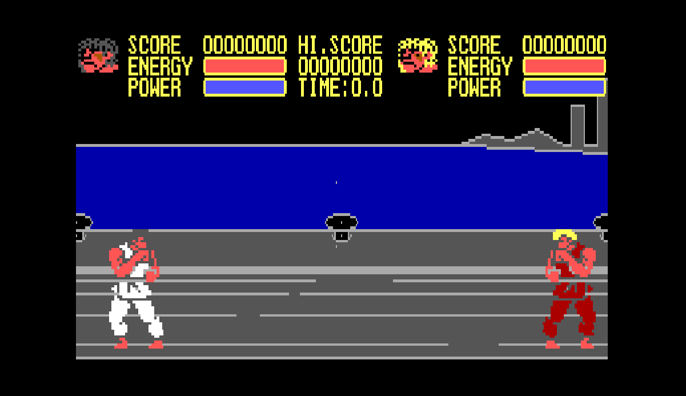

# karate

My fighting game written in Pascal during childhood.

The operating system is MS DOS, so this is running under emulation.

I was a big fan of Street Figher and wanted to build my own game.

I was much harder than I though :-(

I had to draw each pixel by hand, even the music was composed and encoded by hand.

[click here to play!](https://blaisetine.github.io/karate)
